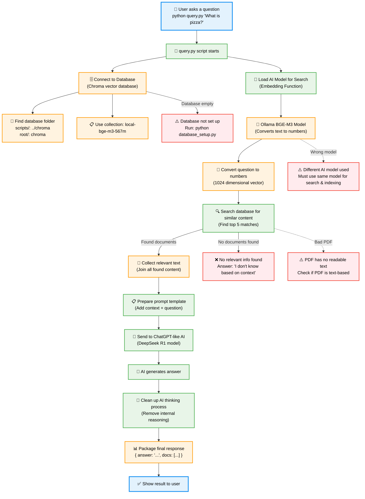
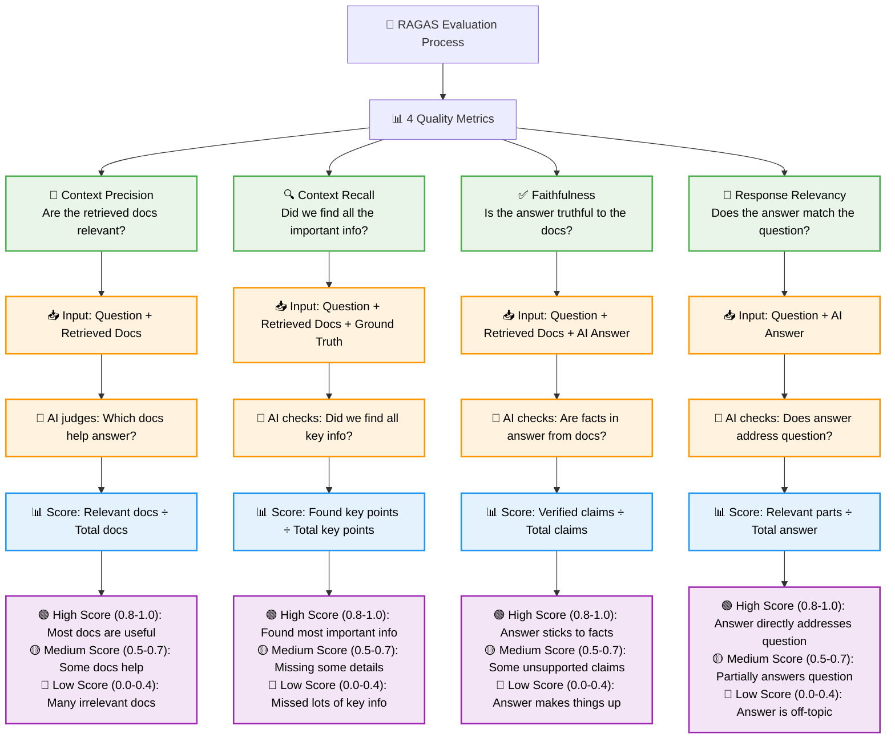

# Evaluate of RAG responses using RAGAS metrics & Pytest

Local RAG Setup for Testing Purposes

## Description

This project explores how to set up a local Retrieval-Augmented Generation (RAG) system for testing purposes. RAG is a powerful technique that combines retrieval-based and generation-based models to improve the quality and relevance of generated text.

## Quick Start

If you want to get started quickly:

1. **Install Ollama** and pull required models:
   ```bash
   ollama pull bge-m3:567m
   ollama pull deepseek-r1:8b
   ```

2. **Set up the project**:
   ```bash
   git clone <your-repo-url>
   cd personalRag
   python -m venv local-ragas-env
   source local-ragas-env/bin/activate
   pip install -r requirements.txt
   ```

3. **Set up database and query**:
   ```bash
   cd scripts
   python database_setup.py
   python query.py "What are the main types of pizza?"
   ```

## Table of Contents

- [Quick Start](#quick-start)
- [OS requirements](#os-requirements)
- [Installation](#installation)
- [Ollama Setup](#ollama-setup)
- [Environment Variables](#environment-variables)
- [Database Setup](#database-setup)
- [RAG System Usage](#rag-system-usage)
- [Testing](#testing)
- [Contributing](#contributing)
- [License](#license)

## OS requirements

- **Python 3.10+** (tested with Python 3.13)
- **pip** (Python package manager)
- **git** (version control)
- **Ollama** (for local AI models)

### Virtual Environment Setup

Create and manage a virtual environment for this project:

**For macOS/Linux:**
```bash
# Create virtual environment
python -m venv local-ragas-env

# Activate virtual environment
source local-ragas-env/bin/activate

# Deactivate virtual environment (when done)
deactivate
```

**For Windows:**
```bash
# Create virtual environment
python -m venv local-ragas-env

# Activate virtual environment
.\local-ragas-env\Scripts\activate.bat

# Deactivate virtual environment (when done)
deactivate
```

## Installation

1. Clone the repository:
    ```bash
    git clone <your-repository-url>
    cd personalRag
    ```

2. Create and activate virtual environment:
    ```bash
    python -m venv local-ragas-env
    source local-ragas-env/bin/activate  # On Windows: .\local-ragas-env\Scripts\activate.bat
    ```

3. Install the required dependencies:
    ```bash
    pip install -r requirements.txt
    ```

## Ollama Setup

This project uses Ollama for local embeddings and language model inference. Follow these steps to set up Ollama:

1. **Install Ollama**: 
   - Visit [https://ollama.ai](https://ollama.ai) and download Ollama for your operating system
   - Follow the installation instructions for your platform

2. **Install required models**:
   ```bash
   # Install the embedding model (BGE-M3)
   ollama pull bge-m3:567m
   
   # Install the language model (DeepSeek R1)
   ollama pull deepseek-r1:8b
   ```

3. **Verify Ollama is running**:
   ```bash
   # Check if Ollama service is running (should show installed models)
   ollama list
   
   # If Ollama is not running, start it
   ollama serve
   ```

## Environment Variables

You can optionally set environment variables under a `.env` file (not required for Ollama setup):

```
# Optional: Only needed if switching back to OpenAI embeddings
OPENAI_API_KEY="{your_openai_api_key}"
```

## How the RAG System Works



### 🔄 **Simple Flow Summary:**
1. **User asks** → 2. **Find similar docs** → 3. **Ask AI with context** → 4. **Return clean answer**

## RAGAS Evaluation Metrics

RAGAS helps us measure how good our RAG system is by testing 4 key areas. Think of it like a report card for your AI:



### 📊 **What Each Metric Tests:**

| Metric | What it asks | What you need | Good Score means | Bad Score means |
|--------|-------------|---------------|------------------|-----------------|
| **🎯 Context Precision** | "Are these docs helpful?" | Question + Retrieved docs | Search found useful info | Search returned junk |
| **🔍 Context Recall** | "Did we find everything?" | Question + Docs + Truth | Found most key details | Missed important info |
| **✅ Faithfulness** | "Is the answer honest?" | Question + Docs + Answer | AI stuck to the facts | AI made things up |
| **📝 Response Relevancy** | "Does this answer the question?" | Question + Answer | Direct, focused answer | Off-topic response |

### 🎯 **Quick Interpretation Guide:**

- **Score 0.8-1.0**: 🟢 **Excellent** - System working great!
- **Score 0.5-0.7**: 🟡 **Needs work** - Some issues to fix
- **Score 0.0-0.4**: 🔴 **Poor** - Major problems, needs attention

### 🔧 **Common Issues & Solutions:**

| Low Score In | Probable Cause | How to Fix |
|-------------|----------------|------------|
| **Context Precision** | Search returning irrelevant docs | Improve embeddings, adjust chunk size |
| **Context Recall** | Missing important documents | Add more docs, improve search parameters |
| **Faithfulness** | AI hallucinating facts | Better prompts, check retrieved context |
| **Response Relevancy** | AI going off-topic | Improve prompt template, tune AI model |

## Database Setup

Before using the RAG system, you need to set up the vector database with your documents:

1. **Place your PDF documents** in the `data/` directory

2. **Set up the database** (run from the project root):
   ```bash
   # Activate virtual environment
   source local-ragas-env/bin/activate
   
   # Navigate to scripts directory
   cd scripts
   
   # Create/populate the vector database
   python database_setup.py
   
   # Optional: Reset the database if you want to start fresh
   python database_setup.py --reset
   ```

3. **Verify database creation**:
   - Check that a `chroma/` directory was created in the project root
   - The database will contain embeddings of your PDF documents

## RAG System Usage

Once the database is set up, you can query your documents:

### Basic Query Usage

```bash
# Navigate to scripts directory (if not already there)
cd scripts

# Activate virtual environment
source ../local-ragas-env/bin/activate

# Run a query
python query.py "What are the main types of pizza?"

# Example with a specific question
python query.py "Where was the largest pizza ever made?"
```

### Query Response Format

The system returns a JSON response with:
- `answer`: The AI-generated response based on retrieved documents
- `retrieved_docs`: List of relevant document chunks with metadata

Example response:
```json
{
  "answer": "The largest pizza ever made measured over 13,000 square feet in Rome, Italy, in 2012.",
  "retrieved_docs": [
    {
      "file_name": "data/pizza_rag_test_expanded.pdf:6:0",
      "page_content": "Fun Facts About Pizza\nThe largest pizza ever made..."
    }
  ]
}
```

## Testing

The project includes RAGAS evaluation tests for measuring RAG system performance:

> **Note**: Tests require an OpenAI API key for RAGAS evaluation metrics. Set `OPENAI_API_KEY` in your environment or `.env` file.

1. **Set the PYTHONPATH environment variable**:
   ```bash
   export PYTHONPATH="${PYTHONPATH}:/path/to/your/personalRag"
   # Example: export PYTHONPATH="${PYTHONPATH}:/Users/joanesquivel/Desktop/personalRag"
   ```

2. **Run specific tests** (from project root):
   ```bash
   # Activate virtual environment
   source local-ragas-env/bin/activate
   
   # Run individual tests (-s flag shows print statements)
   pytest tests/test_response_relevancy.py -s
   pytest tests/test_context_precision.py -s
   pytest tests/test_context_recall.py -s
   pytest tests/test_faithfulness.py -s
   
   # Run all tests
   pytest tests/ -s
   ```

3. **Available test metrics**:
   - **Response Relevancy**: Measures how relevant the answer is to the question
   - **Context Precision**: Evaluates if retrieved contexts are relevant to the question
   - **Context Recall**: Checks if the retrieved context contains information needed to answer
   - **Faithfulness**: Measures if the answer is faithful to the retrieved context


## Contributing

If you want to contribute to this project, please follow these steps:

1. Fork the repository.
2. Create a new branch.
3. Make your changes and commit them.
4. Push to the branch.
5. Create a pull request.


## License

This project is licensed under the MIT License, which means you can use, copy, modify, and distribute the software, but you must include the original license and copyright notice in any copies or substantial portions of the software. See the LICENSE file for more details.