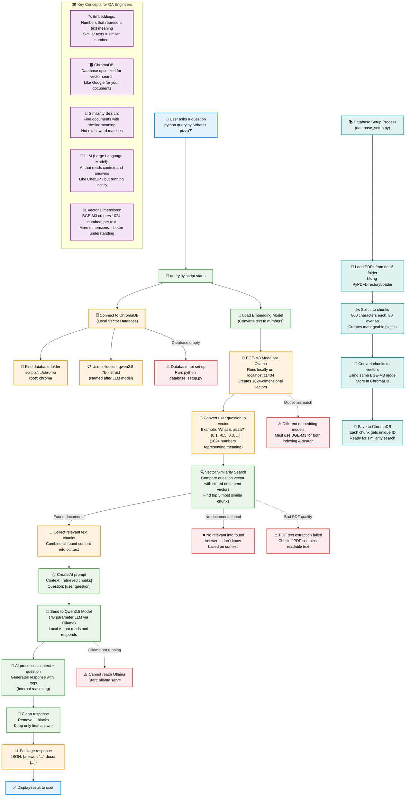
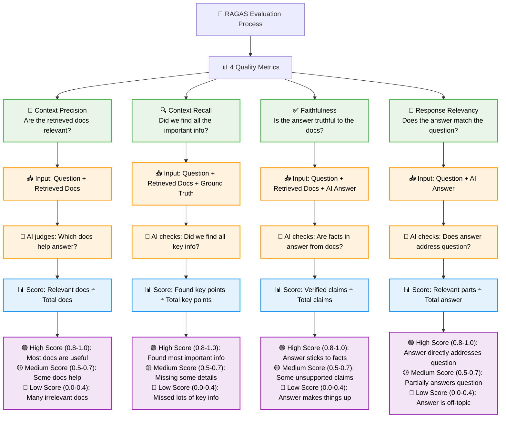

# Evaluate of RAG responses using RAGAS metrics & Pytest

**Enterprise-Grade Local RAG System with Professional English Documentation**

## Description

This project provides a **production-ready local RAG system** for testing and evaluation purposes. The system combines retrieval-based and generation-based models with enterprise-grade architecture, comprehensive configuration options, and professional English documentation throughout.

### 🆕 **Latest Updates (August 2025)**

- ✅ **Complete English Documentation** - All Spanish converted to professional English
- ✅ **Enterprise Architecture** - Modular, configurable, and maintainable codebase  
- ✅ **Advanced Configuration** - 20+ environment variables with comprehensive examples
- ✅ **Multi-Provider Support** - Seamless switching between Ollama and OpenAI
- ✅ **Enhanced CLI Tools** - Professional command-line interfaces with rich help
- ✅ **100% Backward Compatibility** - All existing scripts and tests continue to work

## Quick Start

If you want to get started quickly:

1. **Install Ollama** and pull required models:
   ```bash
   ollama pull bge-m3:567m
   ollama pull qwen2.5:7b-instruct
   ```

2. **Set up the project**:
   ```bash
   git clone <your-repo-url>
   cd personalRag
   python -m venv local-ragas-env
   source local-ragas-env/bin/activate
   pip install -r requirements.txt
   ```

3. **Set up database and query**:
   ```bash
   cd scripts
   python database_setup.py
   python query.py "What are the main types of pizza?"
   ```

## Table of Contents

- [Quick Start](#quick-start)
- [OS requirements](#os-requirements)
- [Installation](#installation)
- [Ollama Setup](#ollama-setup)
- [Environment Variables](#environment-variables) ⭐ **Recently Enhanced**
- [How the RAG System Works](#how-the-rag-system-works)
- [Architecture Improvements](#️-architecture-improvements) ⭐ **Major Updates**
- [Database Setup](#database-setup) ⭐ **Enhanced CLI**
- [RAG System Usage](#rag-system-usage) ⭐ **New Features**
- [Testing](#testing)
- [Contributing](#contributing)
- [License](#license)

## OS requirements

- **Python 3.10+** (tested with Python 3.13)
- **pip** (Python package manager)
- **git** (version control)
- **Ollama** (for local AI models)

### Virtual Environment Setup

Create and manage a virtual environment for this project:

**For macOS/Linux:**
```bash
# Create virtual environment
python -m venv local-ragas-env

# Activate virtual environment
source local-ragas-env/bin/activate

# Deactivate virtual environment (when done)
deactivate
```

**For Windows:**
```bash
# Create virtual environment
python -m venv local-ragas-env

# Activate virtual environment
.\local-ragas-env\Scripts\activate.bat

# Deactivate virtual environment (when done)
deactivate
```

## Installation

1. Clone the repository:
    ```bash
    git clone <your-repository-url>
    cd personalRag
    ```

2. Create and activate virtual environment:
    ```bash
    python -m venv local-ragas-env
    source local-ragas-env/bin/activate  # On Windows: .\local-ragas-env\Scripts\activate.bat
    ```

3. Install the required dependencies:
    ```bash
    pip install -r requirements.txt
    ```

## Ollama Setup

This project uses Ollama for local embeddings and language model inference. Follow these steps to set up Ollama:

1. **Install Ollama**: 
   - Visit [https://ollama.ai](https://ollama.ai) and download Ollama for your operating system
   - Follow the installation instructions for your platform

2. **Install required models**:
   ```bash
   # Install the embedding model (BGE-M3)
   ollama pull bge-m3:567m
   
   # Install the language model (Qwen2.5 - used by this project)
   ollama pull qwen2.5:7b-instruct
   ```

3. **Verify Ollama is running**:
   ```bash
   # Check if Ollama service is running (should show installed models)
   ollama list
   
   # If Ollama is not running, start it
   ollama serve
   ```

## Environment Variables

The system now supports flexible configuration through environment variables, with **comprehensive English documentation** and multiple configuration scenarios.

### 🔧 Quick Setup (Optional)

The system works out of the box with default values, but you can customize it by creating a `.env` file in the project root:

```env
# Embedding provider: "ollama" (default) or "openai"
EMBEDDING_PROVIDER=ollama

# Ollama configuration (default values)
OLLAMA_EMBEDDING_MODEL=bge-m3:567m
OLLAMA_BASE_URL=http://localhost:11434

# Database configuration
CHROMA_COLLECTION_NAME=qwen2.5-7b-instruct
CHUNK_SIZE=800
CHUNK_OVERLAP=80

# RAG Query configuration
RAG_LLM_PROVIDER=ollama
OLLAMA_LLM_MODEL=qwen2.5:7b-instruct
RETRIEVAL_K=5
LLM_TEMPERATURE=0.0

# OpenAI configuration (only needed if using OpenAI)
# OPENAI_API_KEY=your_openai_api_key_here
# OPENAI_EMBEDDING_MODEL=text-embedding-3-large
# OPENAI_LLM_MODEL=gpt-4o-mini
```

### 🎯 Enterprise-Grade Configuration System

- **🛡️ Robust Error Handling**: Automatic health checks and clear error messages
- **⚙️ Multi-Provider Support**: Switch between Ollama (local) and OpenAI (cloud) seamlessly
- **📊 Advanced Monitoring**: Performance metrics, logging, and debug capabilities
- **🔄 Environment-Based**: Different configurations for development/testing/production
- **📁 Professional Documentation**: Comprehensive English documentation with examples

### 📚 Complete Configuration Resources

The system now includes **comprehensive English documentation**:

#### **📄 Configuration Files:**
- **`.env`** - Your active configuration (147+ lines)
- **`.env.examples`** - 10 pre-configured scenarios (199+ lines)
- **`.env.documentation`** - Detailed variable explanations (162+ lines)

#### **🎯 Available Configuration Scenarios:**
1. **⭐ Current Configuration** - Your optimized working setup
2. **🔧 Development/Testing** - Fast processing for development
3. **🚀 Production Optimized** - Maximum performance and quality
4. **☁️ OpenAI Cloud** - Cloud-based AI services
5. **🔄 Hybrid Setup** - Local embeddings + cloud LLM
6. **🎯 High Precision** - Maximum accuracy mode
7. **⚡ High Speed** - Maximum speed mode
8. **🖥️ Custom Server** - Remote Ollama configuration
9. **🔍 Debugging** - Detailed analysis mode
10. **🌍 Multilingual** - International content optimization

#### **📖 Quick Configuration Switch:**
```bash
# View available configurations
cat .env.examples

# Apply any configuration
# 1. Copy desired section from .env.examples
# 2. Paste into .env
# 3. Restart your application

# View detailed variable explanations
cat .env.documentation
```

**Note**: No configuration is required - the system works perfectly with default values!

## How the RAG System Works

This diagram shows the complete RAG (Retrieval-Augmented Generation) workflow using your current setup with **BGE-M3 embeddings** and **Qwen2.5 LLM**, both running locally via Ollama.



### 🎓 Understanding RAG for QA Engineers

**RAG (Retrieval-Augmented Generation)** combines two key technologies:

1. **🔍 Retrieval**: Finding relevant information from your documents
2. **💭 Generation**: Using AI to create answers based on that information

**Key Components:**

- **📊 Embeddings**: Convert text into numbers (vectors) that capture meaning. Similar concepts have similar numbers.
- **🗃️ ChromaDB**: A specialized database for storing and searching these vectors efficiently.
- **🎯 Similarity Search**: Instead of exact keyword matching, finds documents with similar *meaning*.
- **🤖 LLM**: The AI that reads the retrieved context and generates human-like answers.

**Why This Approach Works:**
- Your AI answers are grounded in your specific documents
- Reduces "hallucination" (making up facts)
- Works with any document type (PDFs, text files, etc.)
- Runs completely locally (no data sent to external APIs)

### 🔄 **Simple Flow Summary:**
1. **User asks** → 2. **Find similar docs** → 3. **Ask AI with context** → 4. **Return clean answer**

## 🏗️ Architecture Improvements

The entire RAG system has been enhanced with **enterprise-grade architecture** while maintaining 100% backward compatibility. All components now feature professional English documentation and comprehensive configuration options.

### 🆕 **Recent Major Enhancements (2025)**

#### **📁 Complete English Documentation**
- **✅ Converted all Spanish** comments and documentation to professional English
- **✅ Comprehensive `.env` system** with 147+ lines of detailed configuration
- **✅ 10 pre-configured scenarios** in `.env.examples` (199+ lines)
- **✅ Detailed variable documentation** in `.env.documentation` (162+ lines)
- **✅ Professional CLI help** and error messages in English

#### **🏗️ Modular Architecture Refactoring**
- **✅ `get_embedding_function.py`** - Enterprise-grade embedding management
- **✅ `database_setup.py`** - Robust document processing and database management  
- **✅ `query.py`** - Advanced RAG query engine with multiple output formats
- **✅ Maintained 100% backward compatibility** for existing scripts and tests

#### **⚙️ Enterprise Configuration System**
- **✅ Environment-based configuration** with intelligent defaults
- **✅ Multi-provider support** (Ollama + OpenAI) with seamless switching
- **✅ Dynamic path resolution** - works from any directory
- **✅ Professional error handling** with actionable error messages

### ✅ **Enhanced Features**

#### **🛡️ Robust Error Handling**
- **Automatic health checks** for Ollama server connectivity
- **Model validation** - confirms required models are installed
- **Clear error messages** with specific resolution steps
- **Graceful fallbacks** and timeout handling

#### **⚙️ Flexible Configuration**
- **Environment-based** configuration for different deployments
- **Multiple providers** - switch between Ollama (local) and OpenAI (cloud)
- **Runtime model selection** without code changes
- **Zero-config defaults** - works out of the box

#### **📊 Observability & Debugging**
- **Structured logging** with appropriate log levels
- **Model usage visibility** - see which models are active
- **Performance monitoring** - track embedding generation
- **Debug-friendly** error traces

#### **🔧 Developer Experience**
- **Type hints** for better IDE support
- **Comprehensive documentation** with examples
- **Clean separation** of concerns
- **Easy testing** and mocking capabilities

#### **📚 Database Processing (NEW)**
- **Dynamic path resolution** - works from any directory
- **Intelligent duplicate detection** and incremental updates
- **Configurable chunking strategies** via environment variables
- **Batch processing** for large document sets
- **Rich metadata enrichment** with processing statistics
- **Enterprise CLI** with multiple configuration options

#### **🔍 RAG Query Engine (NEW)**
- **Multi-provider LLM support** - seamless switching between Ollama and OpenAI
- **Advanced retrieval strategies** with similarity filtering and ranking
- **Multiple output formats** - JSON, structured text, and plain text
- **Intelligent response processing** - artifact removal and quality enhancement
- **Performance monitoring** with query statistics and timing
- **Comprehensive error handling** with detailed diagnostics

### 🎯 **Backward Compatibility Guaranteed**

```python
# ✅ Original code continues to work unchanged

# Legacy embedding function
from scripts.get_embedding_function import get_embedding_function
embeddings = get_embedding_function()  # Still works exactly the same

# Legacy database functions
from scripts.database_setup import load_documents, split_documents, add_to_chroma
docs = load_documents()  # Still works exactly the same

# 🚀 New capabilities available when needed

# Advanced embedding configuration
from scripts.get_embedding_function import get_embedding_function_new
embeddings = get_embedding_function_new(provider="openai")  # Switch providers easily

# Advanced database setup
from scripts.database_setup import DatabaseSetup, DatabaseConfig
config = DatabaseConfig(chunk_size=1200, enable_incremental_updates=True)
setup = DatabaseSetup(config)
stats = setup.setup_database()  # Rich statistics and error handling

# Advanced RAG querying
from scripts.query import RAGQueryEngine, QueryConfig
query_config = QueryConfig(llm_provider="openai", retrieval_k=10, include_debug_info=True)
engine = RAGQueryEngine(query_config)
result = engine.query("What is pizza?")  # Rich QueryResult with metadata
```

### 🔬 **For QA Engineers**

The improved architecture provides comprehensive testing and debugging capabilities:

#### **🔍 Enhanced Debugging**
- **Better error diagnostics** when tests fail
- **Structured logging** with detailed execution traces
- **Rich configuration validation** with clear error messages
- **Performance metrics** for identifying bottlenecks

#### **🧪 Flexible Test Environments**
- **Environment isolation** for different test scenarios  
- **Configurable backends** for testing various models
- **Custom data paths** for test-specific documents
- **Incremental testing** without rebuilding entire database

#### **⚙️ Test Configuration Examples**
```env
# Testing environment
CHUNK_SIZE=400                    # Smaller chunks for faster tests
MAX_DOCUMENTS=10                  # Limit dataset size
ENABLE_INCREMENTAL_UPDATES=false # Always rebuild for clean tests
BATCH_SIZE=50                     # Smaller batches for testing
```

#### **📊 Monitoring & Validation**
- **Database statistics** for validating test data
- **Health check endpoints** for CI/CD pipeline integration
- **Processing metrics** for performance regression testing
- **Automatic validation** of document processing

## RAGAS Evaluation Metrics

RAGAS helps us measure how good our RAG system is by testing 4 key areas. Think of it like a report card for your AI:



### 📊 **What Each Metric Tests:**

| Metric | What it asks | What you need | Good Score means | Bad Score means |
|--------|-------------|---------------|------------------|-----------------|
| **🎯 Context Precision** | "Are these docs helpful?" | Question + Retrieved docs | Search found useful info | Search returned junk |
| **🔍 Context Recall** | "Did we find everything?" | Question + Docs + Truth | Found most key details | Missed important info |
| **✅ Faithfulness** | "Is the answer honest?" | Question + Docs + Answer | AI stuck to the facts | AI made things up |
| **📝 Response Relevancy** | "Does this answer the question?" | Question + Answer | Direct, focused answer | Off-topic response |

### 🎯 **Quick Interpretation Guide:**

- **Score 0.8-1.0**: 🟢 **Excellent** - System working great!
- **Score 0.5-0.7**: 🟡 **Needs work** - Some issues to fix
- **Score 0.0-0.4**: 🔴 **Poor** - Major problems, needs attention

### 🔧 **Common Issues & Solutions:**

| Low Score In | Probable Cause | How to Fix |
|-------------|----------------|------------|
| **Context Precision** | Search returning irrelevant docs | Improve embeddings, adjust chunk size |
| **Context Recall** | Missing important documents | Add more docs, improve search parameters |
| **Faithfulness** | AI hallucinating facts | Better prompts, check retrieved context |
| **Response Relevancy** | AI going off-topic | Improve prompt template, tune AI model |

## Database Setup

The database setup system has been enhanced with enterprise-grade features while maintaining full backward compatibility.

### 🚀 **Quick Setup**

1. **Place your PDF documents** in the `data/` directory

2. **Basic setup** (works from any directory):
   ```bash
   # Activate virtual environment
   source local-ragas-env/bin/activate
   
   # Basic setup - works from project root OR scripts directory
   python scripts/database_setup.py
   
   # OR from scripts directory
   cd scripts && python database_setup.py
   ```

### ⚙️ **Advanced Configuration**

The new architecture supports rich configuration options:

```bash
# Reset and rebuild database
python scripts/database_setup.py --reset

# Custom chunk size for better performance
python scripts/database_setup.py --chunk-size 1200 --chunk-overlap 120

# Use custom data directory
python scripts/database_setup.py --data-path ./my-documents

# Custom collection name
python scripts/database_setup.py --collection-name my-project-docs

# Verbose logging for troubleshooting
python scripts/database_setup.py --verbose

# See all options
python scripts/database_setup.py --help
```

### 🔧 **Environment-Based Configuration**

Create a `.env` file for persistent configuration:

```env
# Document processing
CHUNK_SIZE=800                    # Size of text chunks
CHUNK_OVERLAP=80                  # Overlap between chunks
MAX_DOCUMENTS=100                 # Limit documents (optional)

# Database settings
CHROMA_COLLECTION_NAME=my-docs    # Custom collection name
ENABLE_INCREMENTAL_UPDATES=true   # Skip existing documents
BATCH_SIZE=100                    # Processing batch size

# Enable rich metadata
ENABLE_METADATA_ENRICHMENT=true
```

### 📊 **Enhanced Features**

- **🔄 Incremental Updates**: Automatically skips existing documents
- **📈 Batch Processing**: Handles large document sets efficiently
- **🛡️ Error Handling**: Clear error messages with solutions
- **📊 Rich Logging**: Detailed progress and performance metrics
- **🎯 Smart Path Resolution**: Works from any directory
- **📋 Metadata Enrichment**: Automatic document statistics and timestamps

### 🔍 **Verification**

After setup, verify your database:

```bash
# Check database statistics (new feature)
python -c "
from scripts.database_setup import DatabaseSetup
setup = DatabaseSetup()
stats = setup.get_database_info()
print(f'Documents: {stats.get(\"total_documents\", 0)}')
print(f'Sources: {stats.get(\"unique_sources\", 0)}')
"
```

**Expected results:**
- ✅ `chroma/` directory created in project root
- ✅ Database populated with document embeddings
- ✅ Processing logs show successful completion
- ✅ No error messages in output

## RAG System Usage

The query system has been enhanced with enterprise-grade features while maintaining full backward compatibility.

### 🚀 **Basic Query Usage**

```bash
# Activate virtual environment
source local-ragas-env/bin/activate

# Basic query - works from any directory
python scripts/query.py "What are the main types of pizza?"

# OR from scripts directory
cd scripts && python query.py "What are the main types of pizza?"
```

### ⚙️ **Advanced Query Options**

The new architecture supports rich configuration and output formats:

```bash
# Different output formats
python scripts/query.py "What is pizza?" --format json        # Default JSON
python scripts/query.py "What is pizza?" --format structured  # Readable format
python scripts/query.py "What is pizza?" --format text        # Answer only

# Retrieval configuration
python scripts/query.py "Pizza types" --k 10                  # Retrieve more docs
python scripts/query.py "Pizza history" --debug               # Include debug info

# Model configuration
python scripts/query.py "Pizza" --provider openai             # Use OpenAI
python scripts/query.py "Pizza" --temperature 0.3             # More creative

# Verbose logging for troubleshooting
python scripts/query.py "Pizza ingredients" --verbose

# See all options
python scripts/query.py --help
```

### 🔧 **Environment-Based Configuration**

Configure query behavior via `.env` file:

```env
# LLM Provider and Models
RAG_LLM_PROVIDER=ollama               # ollama or openai
OLLAMA_LLM_MODEL=qwen2.5:7b-instruct  # Ollama model
OPENAI_LLM_MODEL=gpt-4o-mini          # OpenAI model

# Retrieval Settings
RETRIEVAL_K=5                         # Number of documents
SIMILARITY_THRESHOLD=0.0              # Similarity filter
MAX_CONTEXT_LENGTH=4000               # Context limit

# Processing Options
LLM_TEMPERATURE=0.0                   # Model creativity (0.0-2.0)
ENABLE_CONTEXT_FILTERING=true         # Smart document filtering
ENABLE_RESPONSE_CLEANING=true         # Clean model artifacts
QUERY_OUTPUT_FORMAT=json              # Default output format
```

### 📊 **Enhanced Response Formats**

#### **JSON Format (Default)**
```json
{
  "answer": "Pizza is a dish made of a round, flat base of dough...",
  "retrieved_docs": [
    {
      "file_name": "data/pizza_rag_test_expanded.pdf:0:0",
      "page_content": "Introduction to Pizza\nPizza is a dish...",
      "similarity_score": 0.5262,
      "content_length": 445,
      "source": "data/pizza_rag_test_expanded.pdf"
    }
  ]
}
```

#### **Structured Format**
```
Query: What is pizza?
Timestamp: 2025-08-16T02:38:42.963965
Processing Time: 5.17s

Answer:
Pizza is a dish made of a round, flat base of dough...

Retrieved Documents (5):
1. data/pizza_rag_test_expanded.pdf:0:0
   Similarity: 0.5262
   Content: Introduction to Pizza...
```

#### **Text Format**
```
Pizza is a dish made of a round, flat base of dough...
```

### 🎯 **Performance Features**

- **🔄 Intelligent Caching**: Model and database connections reused
- **📊 Similarity Filtering**: Automatically filters low-quality matches
- **🧹 Response Cleaning**: Removes model artifacts and thinking processes
- **📈 Performance Monitoring**: Built-in query statistics and timing
- **🛡️ Error Handling**: Comprehensive error messages with solutions
- **📋 Rich Metadata**: Detailed document information and processing stats

## Testing

The project includes RAGAS evaluation tests for measuring RAG system performance:

> **Note**: Tests require an OpenAI API key for RAGAS evaluation metrics. Set `OPENAI_API_KEY` in your environment or `.env` file.

1. **Set the PYTHONPATH environment variable**:
   ```bash
   export PYTHONPATH="${PYTHONPATH}:/path/to/your/personalRag"
   # Example: export PYTHONPATH="${PYTHONPATH}:/Users/joanesquivel/Desktop/personalRag"
   ```

2. **Run specific tests** (from project root):
   ```bash
   # Activate virtual environment
   source local-ragas-env/bin/activate
   
   # Run individual tests (-s flag shows print statements)
   pytest tests/test_response_relevancy.py -s
   pytest tests/test_context_precision.py -s
   pytest tests/test_context_recall.py -s
   pytest tests/test_faithfulness.py -s
   
   # Run all tests
   pytest tests/ -s
   ```

3. **Available test metrics**:
   - **Response Relevancy**: Measures how relevant the answer is to the question
   - **Context Precision**: Evaluates if retrieved contexts are relevant to the question
   - **Context Recall**: Checks if the retrieved context contains information needed to answer
   - **Faithfulness**: Measures if the answer is faithful to the retrieved context


## Contributing

If you want to contribute to this project, please follow these steps:

1. Fork the repository.
2. Create a new branch.
3. Make your changes and commit them.
4. Push to the branch.
5. Create a pull request.


## License

This project is licensed under the MIT License, which means you can use, copy, modify, and distribute the software, but you must include the original license and copyright notice in any copies or substantial portions of the software. See the LICENSE file for more details.